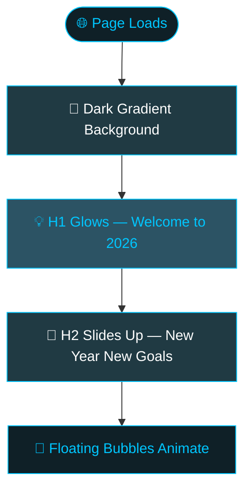

# 🎆 Welcome to 2026 — Canvas Project

> *A New Year • New Goals • New Energy*


---

## ✨ Features

- 🌊 Full page dark gradient background
- 💡 Glowing animated heading
- 🎞️ Smooth fade + slide-up text animations
- 🔵 Floating bubble particles in background
- 📱 Centered responsive layout

---

## 📁 Folder Structure
```
📁 canvas_2026/
   └── 📄 index.html
```

---

## 🔄 Page Flow


---

## 🎨 Animations Used

| Animation | Effect |
|-----------|--------|
| `fadeIn` | Whole container fades in on load |
| `glow` | Heading glows blue infinitely |
| `slideUp` | Subtitle slides up after 1s delay |
| `float` | Bubbles float from bottom to top |

---

## ▶️ How to Run
```bash
1. Clone the repo
2. Open index.html in any browser
3. Happy New Year! 🎆
```

---

> *Built with HTML & CSS only — no frameworks, no libraries* 💪
